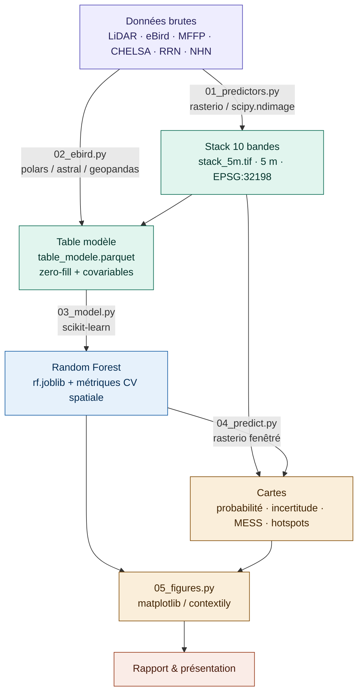

# Modèle de distribution de l'Engoulevent bois-pourri (*Antrostomus vociferus*)
**Équipe :** Alexandre Chéné
*Modèle de distribution d'espèce (SDM) par Random Forest sur checklists eBird zero-fillées, à 5 m de résolution, sur une MRC du Québec méridional. — GMQ-580, Géoinformatique II, Session 3.*

## Problématique
Quelles variables environnementales structurent la présence de l'Engoulevent bois-pourri à l'échelle d'une MRC du Québec méridional, et où le modèle prédit-il des habitats favorables non encore documentés par eBird ?

L'Engoulevent bois-pourri est une espèce en péril (programme de rétablissement ECCC 2018), insectivore aérien et crépusculaire, dont l'habitat de reproduction reste mal cartographié. Le projet vise à produire une carte de probabilité de présence fine (5 m) utile à la priorisation de zones de conservation et d'inventaire.

Hypothèses écologiques testées :
- **H1** — La probabilité d'occurrence augmente avec la densité de lisière forêt-ouvert jusqu'à un optimum intermédiaire (~40–60 % de couvert forestier).
- **H2** — Les sols bien drainés (TWI bas) augmentent la probabilité de présence (préférence pour les substrats secs).
- **H3** — La densité de routes a un effet non-linéaire : faiblement positif à faible densité (lisières + insectes), négatif au-delà d'un seuil (dérangement).
- **H4** — Les peuplements de hauteur et d'âge intermédiaires (~10–20 m) sont préférés aux peuplements matures fermés.

**Hors du cadre de ce projet (POC, 5 semaines + 1 tampon) :** dynamique temporelle pluriannuelle, NDVI/NDWI Sentinel-2, modélisation MaxEnt présence-seule, et toute extrapolation hors de la MRC d'étude.

## Zone d'étude
La zone d'étude est définie par le fichier [`data/zone_etude.gpkg`](data/zone_etude.gpkg) : une MRC du Québec méridional couverte par 35 feuillets LiDAR à 1 m par produit (MHC, MNT, Pentes — 105 rasters, ~150 Go bruts), agrégés à 5 m pour l'analyse. L'échelle de la MRC est retenue car elle offre un compromis entre une couverture LiDAR complète, un nombre suffisant de checklists eBird, et un budget de calcul réaliste sur ordinateur portable. Tous les jeux de données sont harmonisés dans le CRS **EPSG:32198 (NAD83 / Québec Lambert)**.

## Données
| Source | Format | CRS | Accès |
|--------|--------|-----|-------|
| eBird EBD — observations + sampling (Cornell Lab of Ornithology) | TSV compressé | EPSG:4326 | [ebird.org/data/download](https://ebird.org/data/download) — sous [accord de confidentialité](https://www.birds.cornell.edu/home/ebird-data-access-terms-of-use/) |
| Carte écoforestière avec perturbations (MFFP) | GDB / SHP | EPSG:32198 | [Données Québec](https://www.donneesquebec.ca/recherche/dataset/carte-ecoforestiere-avec-perturbations) |
| Produits dérivés du LiDAR — MHC, MNT, Pentes (MRNF) | GeoTIFF 1 m | EPSG:32198 | [Données Québec](https://www.donneesquebec.ca/recherche/dataset/produits-derives-de-base-du-lidar) |
| CHELSA Bio10 — température estivale moyenne (v2.1) | GeoTIFF 1 km | EPSG:4326 | [chelsa-climate.org](https://chelsa-climate.org/downloads/) |
| Réseau routier (Adresses Québec / RRN) | SHP | EPSG:32198 | [Données Québec](https://www.donneesquebec.ca/recherche/dataset/adresses-quebec) |
| Réseau hydrographique national — milieux humides (RNCan) | GDB | EPSG:4269 | [open.canada.ca](https://open.canada.ca/data/fr/dataset/a4b190fe-e090-4e6d-881e-b87956c07977) |

> **⚠️ Données non versionnées.** Les données brutes (~150 Go LiDAR, ~20 Go eBird) et confidentielles (eBird EBD) ne sont **jamais** poussées sur GitHub : tout le dossier `data/` est exclu via [`.gitignore`](.gitignore), à l'exception de l'emprise `data/zone_etude.gpkg` (~100 Ko) et des petits résultats `*.parquet` / `*.json`. Le script [`scripts_independants/telechargement_donnees.py`](scripts_independants/telechargement_donnees.py) documente l'acquisition.

## Modèle de données
Le pipeline produit un **stack raster à 10 bandes** (`data/processed/stack_5m.tif`, ~3 Go, COG DEFLATE 512) et une **table modèle** (`data/processed/table_modele.parquet`) joignant les checklists eBird zero-fillées aux covariables extraites.

**Variables d'habitat (entrées du modèle, cartographiées) :**

| # | Variable | Source | Échelle d'analyse | Hypothèse |
|---|----------|--------|-------------------|-----------|
| 1 | Hauteur moyenne de canopée (MHC) | LiDAR | 5 m + focal | H4 — structure verticale |
| 2 | Indice topographique d'humidité (TWI) | LiDAR | 5 m | H2 — drainage |
| 3 | Densité de lisière forêt-ouvert | Écoforestière MFFP | Focal 1 km | H1 — mosaïque |
| 4 | Proportion forêt feuillue/mélangée | Écoforestière MFFP | Focal 500 m | Composition |
| 5 | Densité de routes (km/km²) | Adresses Québec / RRN | Focal 1 km | H3 — anthropique |
| 6 | Température estivale moyenne (Bio10) | CHELSA v2.1 | 1 km → 5 m | Limite thermique |
| 7 | Classe d'âge du peuplement | Écoforestière MFFP | 5 m | H4 — structure temporelle |
| 8 | Densité du peuplement (fermeture couvert) | Écoforestière MFFP | 5 m | H4 — couvert complémentaire |
| 9 | Distance à un milieu humide | NHN / Canvec | 5 m | Alimentation nocturne |
| 10 | Élévation (MNT) | LiDAR | 5 m | Limite altitudinale (~600 m) |

**Variables de détection (Random Forest uniquement — non cartographiées)** — corrigent le biais d'effort d'observation : `minutes_apres_coucher` (via `astral`, fuseau `America/Toronto`, DST géré), `phase_lune`, `log_duree`, `jour_julien`.

## Pipeline de traitement ou Architecture
Pipeline de traitement séquentiel en cinq scripts numérotés (dossier [`code/`](code/)). Toutes les opérations raster sont **fenêtrées / tuile par tuile** : la mosaïque complète n'est jamais chargée en RAM.



| Script | Rôle | Livrable |
|--------|------|----------|
| `utils.py` | Fonctions partagées : I/O, CRS, focal stats, MESS | — |
| `01_predictors.py` | LiDAR → tuiles 5 m → VRT → variables paysagères → stack | `stack_5m.tif` (10 bandes, ~3 Go) |
| `02_ebird.py` | EBD filtré → zero-fill → variables de détection → extraction covariables | `table_modele.parquet` |
| `03_model.py` | RF + tuning + validation spatiale + importance + PDP | `rf.joblib`, métriques CV |
| `04_predict.py` | Carte proba (fenêtrée) + incertitude + MESS + hotspots | GeoTIFF COG + GeoPackage |
| `05_figures.py` | Toutes les figures du rapport | PNG exports |

## Librairies principales (ou stack)
Projet Python géré avec **`uv`** (`pyproject.toml` + `uv.lock` versionné pour la reproductibilité).

| Usage | Librairie | Justification |
|-------|-----------|---------------|
| Tabulaire | `polars` | `scan_csv` lazy pour l'EBD volumineux ; `to_pandas()` seulement à l'entrée sklearn |
| Vecteur | `geopandas` | clip, reprojection, jointures spatiales |
| Raster | `rasterio` + `rioxarray` | `rasterio` pour les opérations fenêtrées ; `rioxarray` pour les stacks légères |
| Numérique | `numpy` + `scipy.ndimage` | focal stats via `uniform_filter` (séparable = rapide) |
| Modèle | `scikit-learn` | RF + validation croisée spatiale + importance par permutation + PDP |
| Soleil / lune | `astral` | minutes après coucher du soleil, fraction lunaire |
| Cartes | `matplotlib` + `contextily` | fonds de carte OSM pour les cartes finales |
| Progression | `tqdm` | barres de progression pour les boucles tuile par tuile |

## Livrables attendus
| # | Livrable | Format |
|---|----------|--------|
| 1 | Rapport final (~15–20 pages) | Markdown + figures |
| 2 | Dépôt Git reproductible (`uv sync` + `01` → `05`) | GitHub public |
| 3 | Carte de probabilité de présence à 5 m | GeoTIFF COG + PNG |
| 4 | Carte d'incertitude (variance inter-arbres) | GeoTIFF COG + PNG |
| 5 | Carte MESS (zones d'extrapolation) | GeoTIFF COG + PNG |
| 6 | Hotspots favorables non échantillonnés (5 zones) | GeoPackage + CSV |

## État d'avancement
| Étape | Statut |
|-------|--------|
| Acquisition des données (LiDAR, eBird, écoforestière, CHELSA) | ✅ Complété |
| Initialisation du dépôt (structure, `.gitignore`, `pyproject.toml`, README) | ✅ Complété |
| `01_predictors.py` — stack 10 bandes à 5 m | ⏳ À faire |
| `02_ebird.py` — table modèle zero-fillée | ⏳ À faire |
| `03_model.py` — Random Forest + validation spatiale | ⏳ À faire |
| `04_predict.py` — cartes proba / incertitude / MESS / hotspots | ⏳ À faire |
| `05_figures.py` — figures du rapport | ⏳ À faire |

## Décisions méthodologiques
- **Modèle unique Random Forest présence-absence** (`class_weight="balanced"`) plutôt que MaxEnt : les listes complètes eBird zero-fillées (`auk_zerofill`) fournissent des absences confirmées, plus robustes que les méthodes présence-seule. MaxEnt retiré pour concentrer l'effort sur un pipeline reproductible et bien validé.
- **Filtres d'effort** (Johnston et al. 2021) : protocoles Stationary/Traveling, listes complètes, durée ≤ 300 min, distance ≤ 5 km, ≤ 10 observateurs, saison juin–juillet (pic d'activité vocale).
- **Validation spatiale** : `GroupKFold` avec blocs spatiaux de 10 km pour découpler l'autocorrélation spatiale ; métriques AUC-ROC + TSS sur 5 folds.
- **Tuning** : `RandomizedSearchCV` (20 itérations) sur `n_estimators`, `max_features`, `min_samples_leaf`, `max_depth`.
- **Résolution 5 m, CRS EPSG:32198** uniques pour tous les rasters et vecteurs ; rasters de sortie en COG DEFLATE blocksize 512 ; `random_state=42` partout.
- **Extraction des covariables eBird** dans un buffer de 30 m autour du point GPS (précision eBird ≈ 5–30 m).
- **Variables exclues** (justifiées dans le rapport) : domaine bioclimatique (variance nulle à l'échelle MRC), pente (implicite dans le TWI), NDVI/NDWI (prétraitement Sentinel-2 hors budget), type de sol et autres redondances (corrélation / VIF élevé).

## Difficultés rencontrées
- **~150 Go de LiDAR brut à 1 m** : impossible à charger en mémoire. Solution adoptée — tout le pipeline fonctionne par fenêtres `rasterio.windows` et tuiles, avec `os.environ["GDAL_CACHEMAX"] = "512"` dans chaque worker. Repli 10 m possible (constante `RESOLUTION_M` dans `utils.py`) si la RAM est insuffisante.
- **eBird EBD volumineux (~20 Go)** : lecture lazy via `polars.scan_csv()`, conversion `to_pandas()` uniquement à l'entrée de sklearn.
- **Confidentialité eBird** : exclusion stricte des données brutes du dépôt Git (voir `.gitignore`).

---

## Installation
```bash
git clone https://github.com/Corydalus/GMQ-580-Projet_session.git
cd GMQ-580-Projet_session
uv sync                 # crée le .venv et installe les dépendances depuis uv.lock
```
Les données brutes ne sont pas incluses : se référer au tableau **Données** et au script `scripts_independants/telechargement_donnees.py` pour les télécharger dans `data/`.

## Utilisation
Exécuter les scripts dans l'ordre depuis la racine du projet :
```bash
uv run python code/01_predictors.py   # → data/processed/stack_5m.tif
uv run python code/02_ebird.py        # → data/processed/table_modele.parquet
uv run python code/03_model.py        # → outputs/models/rf.joblib + métriques CV
uv run python code/04_predict.py      # → outputs/maps/*.tif + hotspots.gpkg
uv run python code/05_figures.py      # → outputs/figures/*.png
```

## Structure du dépôt
```
GMQ-580-Projet_session/
├── README.md
├── pyproject.toml · uv.lock · .gitignore
├── code/                 # 01 → 05 + utils.py
├── notebooks/            # exploration
├── scripts_independants/ # téléchargement des données
├── data/                 # NON versionné (sauf zone_etude.gpkg et résultats parquet/json)
│   ├── raw/ · interim/ · processed/
│   ├── mhc/ · mnt/ · pente/ · climat/ · ebird/   # données brutes locales
│   └── zone_etude.gpkg
└── outputs/              # figures/ · tables/ (versionnés) · maps/ · models/ (ignorés)
```
> Les documents de travail (`CLAUDE.md`, `methodologie_pour_README.md`,
> `rapport/`, `Recherche documentaire/`) sont conservés **en local** mais exclus
> du dépôt via `.gitignore`.

## Références
- Johnston, A. et al. (2021). Analytical guidelines to increase the value of community science data: an example using eBird data to estimate species distributions. *Diversity and Distributions*, 27, 1265–1277. https://doi.org/10.1111/ddi.13271
- Strimas-Mackey, M. et al. (2023). *Best Practices for Using eBird Data*. Cornell Lab of Ornithology. https://ebird.github.io/ebird-best-practices/
- Guisan, A., Thuiller, W. & Zimmermann, N.E. (2017). *Habitat Suitability and Distribution Models*. Cambridge University Press.
- Valavi, R. et al. (2019). blockCV: an R package for generating spatially or environmentally separated folds. *Methods in Ecology and Evolution*, 10, 225–232.
- Wilson, M.D. & Watts, B.D. (2008). Response of Whip-poor-wills to landscape level habitat features in the Coastal Plain of Virginia. *Wilson Journal of Ornithology*, 120, 778–783.
- ECCC (2018). *Programme de rétablissement de l'Engoulevent bois-pourri au Canada*. Gouvernement du Canada.

---

## Instructions du cours (gabarit original du professeur)
> Le gabarit de README fourni par le professeur est conservé ci-dessous tel quel. Les sections ci-dessus en reprennent exactement la structure.

<details>
<summary>Afficher le gabarit original</summary>

```markdown
# Titre du projet
**Équipe :** Prénom Nom / Prénom Nom
*Changez le titre du projet, il peut évoluer dans le temps. Nommez les membres du groupe*

## Problématique
*Une courte description de l'objectif du projet*
- Quel phénomène ou enjeu géomatique voulez-vous étudier ?
- Pourquoi ce sujet est-il pertinent dans la région choisie ?
- Qui serait concerné par les résultats (municipalité, citoyens, urbanistes, chercheurs) ?
- Qu'est-ce que vous n'allez pas traiter, pour rester réaliste dans le temps disponible ?
- Travaillez-vous à l'échelle du bâtiment, du quartier, de la ville, de la région ?
- Avez-vous déjà identifié une source de données qui permettrait de répondre à cette question ?

## Zone d'étude
*Localisation, échelle, pourquoi ce choix ?*

## Données
*Listez les données pertinentes* — tableau Source / Format / CRS / Accès

## Modèle de données
*Utile si architecture client/serveur/base de données.*

## Pipeline de traitement ou Architecture
*Étapes du pipeline ou architecture applicative. Schéma Mermaid ou image.*

## Librairies principales (ou stack)
*Liste avec justification du choix.*

## Livrables attendus
*Ce que le projet produira concrètement.*

## État d'avancement
*Tableau de tâches / étapes à compléter.*

## Décisions méthodologiques
*Journal des choix importants avec justification (mis à jour à chaque séance).*

## Difficultés rencontrées
*Problèmes résolus et en cours.*
```
</details>
